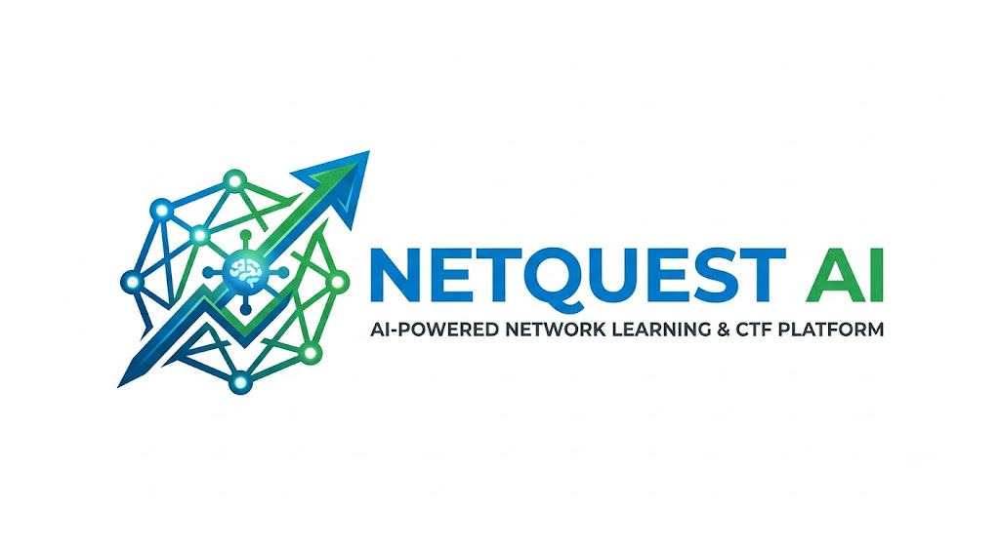

<div align="center">
  
</div>

# NetQuest AI 🌐🤖

> **Hệ thống học mạng máy tính và thi đấu CTF (Capture The Flag) tích hợp trí tuệ nhân tạo.**
> Luyện tập cấu hình mạng thực chiến, nhận phản hồi từ AI, và leo bảng xếp hạng toàn cầu.

---

## 📋 Mục lục

- [Giới thiệu](#giới-thiệu)
- [Tính năng nổi bật (Giai đoạn 2)](#tính-năng-nổi-bật-giai-đoạn-2)
- [Tech Stack](#tech-stack)
- [Cấu trúc dự án](#cấu-trúc-dự-án)
- [Database — Lưu ở đâu?](#database--lưu-ở-đâu)
- [Cài đặt & Chạy dưới local](#cài-đặt--chạy-dưới-local)
- [Chạy với Docker Compose](#chạy-với-docker-compose)
- [API Endpoints](#api-endpoints)
- [Bảo mật](#bảo-mật)

---

## Giới thiệu

**NetQuest AI** là nền tảng học và thi đấu bảo mật mạng kết hợp AI. Người dùng giải các thử thách CTF về cấu hình router, firewall, VLAN, BGP, IDS/IPS… và nhận phản hồi thông minh từ mô hình AI sau mỗi lần nộp bài.

---

## Tính năng nổi bật (Giai đoạn 2)

Hệ thống đã được phát triển hoàn tất các tính năng cốt lõi:
- 🤖 **AI Feedback (Google Gemini API):** Tự động phân tích, đánh giá cấu trúc subnet, định tuyến và đưa ra đề xuất tối ưu hóa bảo mật cho cấu hình mạng của học viên. Tích hợp sẵn *Mock Mode* khi chưa có Key.
- 🎨 **Sơ đồ mạng tương tác (Topology Visualizer):** Render sơ đồ mạng trực tiếp trên UI sử dụng SVG động, kết nối trực quan giữa Router, Firewall, Switch, Server và PC. Xem chi tiết IP/Status khi click vào thiết bị.
- ⚡ **WebSocket Real-time Leaderboard (SignalR):** Bảng xếp hạng trực tuyến cập nhật điểm và hiển thị thông báo thời gian thực ngay khi có học viên giải thành công thử thách.
- 🛠️ **Admin Control Panel (CRUD):** Trang quản trị dành riêng cho Admin để thêm, sửa, xóa các thử thách CTF, cấu hình điểm số và sơ đồ topology bằng JSON.
- 🐳 **Dockerization:** Sẵn sàng triển khai với Dockerfile cho Backend/Frontend và `docker-compose.yml` tích hợp sẵn SQL Server.

---

## Tech Stack

| Layer | Công nghệ |
|-------|-----------|
| **Backend** | ASP.NET Core 10 Web API, Entity Framework Core 9 |
| **Frontend** | React 19, Vite 8, Tailwind CSS v4 |
| **Database** | SQL Server (mặc định cho Dev/Prod) |
| **Real-time** | ASP.NET Core SignalR (WebSockets) |
| **Auth** | JWT Bearer (HS256), BCrypt.Net |
| **State Management** | Zustand + localStorage |
| **HTTP Client** | Axios |
| **API Docs** | Swagger / OpenAPI (Swashbuckle) |
| **Containerization** | Docker, Docker Compose, Nginx |

---

## Cấu trúc dự án

```
NetQuestAI/
├── global.json                          # Ghim .NET SDK 10.0.201
├── docker-compose.yml                   # Khởi chạy SQL Server, API, Frontend
├── .gitignore
├── .gitattributes
├── README.md
│
├── backend/
│   ├── Dockerfile
│   ├── NetQuestAI.sln
│   └── src/
│       └── NetQuestAI.Api/
│           ├── Program.cs               # DI, JWT, CORS, SignalR Hub, Swagger, auto-migrate
│           ├── Controllers/
│           │   ├── AuthController.cs        # Đăng ký/Đăng nhập
│           │   ├── ChallengesController.cs  # CRUD Challenges (Admin)
│           │   ├── SubmissionsController.cs # Nộp flag + AI feedback
│           │   └── LeaderboardController.cs # Điểm số bảng xếp hạng
│           ├── Hubs/
│           │   └── NotificationHub.cs       # WebSocket broadcast thời gian thực
│           ├── Services/
│           │   ├── TokenService.cs          # Tạo JWT
│           │   ├── AuthService.cs           # Đăng ký & Xác thực
│           │   └── GeminiService.cs         # Gọi Gemini API / Phản hồi AI
│           └── Migrations/              # SQL Server EF Core migrations
│
└── frontend/
    ├── Dockerfile
    ├── nginx.conf                       # Cấu hình Web Server + Proxy API/WebSockets
    ├── index.html                       # Favicon (logo) + SEO
    └── src/
        ├── App.tsx                      # Quản lý route công khai & bảo mật
        ├── index.css                    # Design system (cyberpunk dark theme)
        ├── components/
        │   ├── Navbar.tsx               # Thanh điều hướng tự động nhận diện role Admin
        │   ├── ProtectedRoute.tsx       # Bảo vệ route bằng JWT
        │   └── TopologyVisualizer.tsx   # Render sơ đồ SVG tương tác
        └── pages/
            ├── LandingPage.tsx          # Giới thiệu & Terminal mô phỏng
            ├── LoginPage.tsx
            ├── RegisterPage.tsx
            ├── DashboardPage.tsx        # Dashboard thống kê cá nhân
            ├── ChallengesPage.tsx       # Danh sách thử thách
            ├── ChallengeDetailsPage.tsx # Giao diện làm bài + Visualizer + AI feedback
            ├── LeaderboardPage.tsx      # Bảng xếp hạng trực tiếp
            └── AdminPage.tsx            # CRUD thử thách (Admin)
```

---

## Database — Lưu ở đâu?

Database mặc định hiện tại là **Microsoft SQL Server**.

### Connection String (Development dưới local)
Trong `backend/src/NetQuestAI.Api/appsettings.Development.json`:
```json
"ConnectionStrings": {
  "DefaultConnection": "Server=.;Database=NetQuestAI_Dev;Integrated Security=True;TrustServerCertificate=True"
}
```
*(Nếu bạn dùng LocalDB hoặc phiên bản SQL Express, hãy thay đổi cấu hình `Server` cho phù hợp, ví dụ: `Server=(localdb)\\mssqllocaldb`)*

---

## Cài đặt & Chạy dưới local

### Yêu cầu hệ thống
- **.NET SDK:** 10.0.x
- **Node.js:** 18+ & **npm:** 9+
- **SQL Server:** Đã chạy service và bật chế độ xác thực Windows (Integrated Security).

### Khởi chạy Backend

1. Di chuyển vào thư mục backend:
   ```powershell
   cd backend/src/NetQuestAI.Api
   ```
2. Thực hiện restore và chạy server (Database sẽ tự động migrate và tạo các bảng trong SQL Server khi khởi động lần đầu):
   ```powershell
   dotnet run --urls http://localhost:5000
   ```
   > 🟢 API: **http://localhost:5000** | Swagger: **http://localhost:5000/swagger**

### Khởi chạy Frontend

1. Di chuyển vào thư mục frontend:
   ```powershell
   cd frontend
   ```
2. Cài đặt các thư viện:
   ```powershell
   npm install
   ```
3. Chạy dev server:
   ```powershell
   npm run dev
   ```
   > 🟢 Frontend: **http://localhost:5173**

---

## Chạy với Docker Compose

Nếu bạn muốn chạy toàn bộ hệ thống (Frontend + Backend + SQL Server) trong môi trường container hóa (không cần cài đặt gì thêm ngoài Docker Desktop):

1. Khởi chạy Docker Compose tại thư mục root của dự án:
   ```bash
   docker-compose up --build -d
   ```
2. Các dịch vụ sẽ tự động được khởi chạy trên các cổng sau:
   - **Frontend Web Client:** http://localhost (Cổng 80)
   - **Backend API:** http://localhost:5000
   - **SQL Server Database:** localhost,1433

---

## API Endpoints

### Auth
- `POST /api/auth/register` — Đăng ký tài khoản.
- `POST /api/auth/login` — Đăng nhập nhận JWT.

### Challenges (🔒 Yêu cầu Bearer Token)
- `GET /api/challenges` — Danh sách thử thách (phân trang + lọc theo độ khó).
- `GET /api/challenges/{id}` — Chi tiết thử thách (bao gồm JSON topology).
- `POST /api/challenges` — Tạo thử thách mới *(Admin only)*.
- `PUT /api/challenges/{id}` — Cập nhật thử thách *(Admin only)*.
- `DELETE /api/challenges/{id}` — Xóa thử thách *(Admin only)*.

### Submissions (🔒 Yêu cầu Bearer Token)
- `POST /api/submissions` — Nộp flag + cấu hình để so khớp và sinh phản hồi AI.
- `GET /api/submissions/my` — Lịch sử nộp bài của cá nhân.

### Leaderboard
- `GET /api/leaderboard` — Lấy danh sách xếp hạng điểm số.

---

## Bảo mật

- **Passwords:** Được mã hóa bằng BCrypt (với Work Factor = 10).
- **Flag Hash:** Flags được băm SHA-256 ngay từ lúc tạo và so khớp một chiều phía server, ngăn ngừa lộ flag ở database.
- **CORS Policy:** Được giới hạn cứng chỉ chấp nhận nguồn từ client local (`http://localhost:5173` và `5174`).
